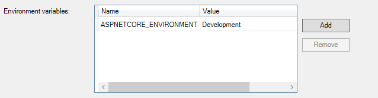
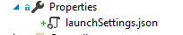

# Setting up a local environment

Do you want to help writing beautiful code? THANK YOU THANK YOU THANK YOU <3

## Requirements

In order to run this project on your computer entirely, you're going to need:

1. An IDE compatible with .NET and Typescript and JSX. I love [Visual Studio Code](https://code.visualstudio.com/), but nothing can beat regular Visual Studio if you're on Windows.
2. A SQL Server instance. You can use Microsoft's docker image. [I put together some instructions to set it up using docker-compose](https://github.com/g3rv4/Traducir/blob/master/docs/MSSQL_DOCKER.md).
3. A [StackApp](https://stackapps.com/) that has `localhost` as the OAuth Domain.
4. [.NET Core](https://www.microsoft.com/net/).
5. A Transifex account with access to the project you want to work with. I'm assuming it's SOes on the instructions. You're going to need an API key that you can generate [on their site](https://www.transifex.com/user/settings/api/).

## Initial setup

### Create the database
Create a database named `Traducir` (it could be whatever, just know that I'm assuming that name) on your SQL Server instance.

It can be accomplished by running `Create Database Traducir` (yes, without uppercases because we don't yell at our database server). Also, I'm using `sa` on my machine... if you don't want to for whatever reason, create a user for the application and make sure it can do anything on that database.

### Set up the app on Visual Studio Code

Open the project and go to Debug => Start Debugging. The first time it should ask you to add some files inside of a `.vscode` folder. Just tell it to go ahead and do it.

Stop it now... we need to configure the environment variables. Everything is set up using environment variables so that it's easy to keep track of them and to make it easy to set up when running the project inside a docker container (that's exactly how I'm running it on prod... and how I'll run it when we have tests. Yes, we will have tests some day).

Open the `.vscode/launch.json` and replace the existing `environmentVariables` key with the following (changing whatever is between `<>` with the appropriate values for you):

```
"environmentVariables": {
    "ASPNETCORE_ENVIRONMENT": "Development",
    "FRIENDLY_NAME": "LOCAL",
    "CONNECTION_STRING": "Server=<SQL SERVER ADDRESS>;Database=Traducir;User Id=<SQL SERVER USER>;Password=<SQL SERVER PASSWORD>;Min Pool Size=5;",

    "STACKAPP_SECRET": "<YOUR STACKAPP SECRET>",
    "STACKAPP_CLIENT_ID": "<YOUR STACKAPP CLIENT ID>",
    "STACKAPP_KEY": "<YOUR STACKAPP KEY>",
    "STACKAPP_SITEDOMAIN": "es.stackoverflow.com",

    "TRANSIFEX_APIKEY": "<YOUR TRANSIFEX API KEY>",
    "TRANSIFEX_RESOURCE_PATH": "api/2/project/stack-overflow-es/resource/english/translation/es/strings/",
    "TRANSIFEX_LINK_PATH": "stack-exchange/stack-overflow-es/translate/#es/english",
    "PUSH_TO_TRANSIFEX_ON_DEV": "False"

    <THIS IS OPTIONAL IF YOU WANT TO PLAY WITH WEB PUSH NOTIFICATIONS>
    "VAPID_SUBJECT": "<SUBJECT OF YOUR VAPID KEY>",
    "VAPID_PUBLIC": "<VAPID PUBLIC KEY>",
    "VAPID_PRIVATE": "<VAPID PRIVATE KEY>",
},
```

Now... if you run it, it should work. Visit `http://localhost:5000/admin/migrate` to run the migrations. That should create all the tables the system uses for you (or run migrations that were created since you last pulled). If you visit `http://localhost:5000/admin/pull` that should populate the strings on your database. Give it a try :)

### Set up the app on Visual Studio 2017

Open the folder Traducir. Once there, double click Traducir.sln. This will open the solution. Before we can continue, we have to configure the enviroment variables for the backend project. This variables are stored on the property pages for `Traducir.Web`. There are two ways to configure this variables.

The hard way, is setting them up manually one by one on the property page of the project. Rigth Click on the project name (Traducir.Web) and click on properties. Go to debug tab, and select the profile IIS Express (should be selected by default). Once there, you can set up this variables on the grid that said environment variables



The easy way, is to modify the file launchSettings.json inside the properties folder on the project



Under profiles, you will see something like this:

```
 "IIS Express": {
      "commandName": "IISExpress",
      "launchBrowser": true,
      "environmentVariables": {
        "ASPNETCORE_ENVIRONMENT": "Development"
      }
    },
```

Replace the "environmentVariables" to (changing whatever is between `<>` with the appropriate values for you) as explained in the `Set up the app on Visual Studio Code` section

When this file is created it will select a default port for your application. This port is inside this file, under "iisSettings",  on "applicationUrl". Feel free to change it if you wish by setting it to something like

```
"applicationUrl": "http://localhost:5000/"
```

Now... if you run it, it should work. Visit `http://localhost:[yourport]/admin/migrate` to run the migrations. That should create all the tables the system uses for you (or run migrations that were created since you last pulled). If you visit `http://localhost:[yourport]/admin/pull` that should populate the strings on your database. Give it a try :)

## Running it

Once you are able to run the project from VS Code, the next time you open the project you can just press F5 or got o Debug => Start Debugging to start the backend. When using VS Code, make sure you set up a build task that's using tsc to watch TS files for changes. If you are using Visual Studio, make sure you have the Typescript SDK installed.

And that's it! if you go to `http://localhost:[yourport]` everything should work as expected. You should be able to do searches. And if you click on "Log In", that should work as well.

If you want to test being a trusted user or a reviewer, you can go to `users` and click on the "Impersonate" button (as long as you're using the `DebugRisky` build configuration).

**WARNING:** Pushes to transifex are going to fail for you unless you are a reviewer on their system. If you *are*, I strongly suggest that you don't use your main account's API key, as you will end up pushing trash to Transifex. *This only applies to site moderators*.
